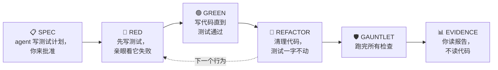

# reliable-coding（中文说明）

> 本文是 [README.md](README.md) 的中文版。

一个让 coding agent **自证其码**的 skill。你不用逐行读 agent 写的代码——agent 必须让代码闯过一整套检查关卡，并且在写代码前交给你一份测试计划、写完后交给你一份证据报告。你审的是这两份文档，不是代码。

skill 就是纯 markdown，任何能遵循指令的 coding agent 都能用：Claude Code、Codex CLI、Cursor、Aider，或你自己的 agent loop。

## 安装（Installation）

```sh
npx skills add https://github.com/amazingang/reliable-coding-skill
```

也可以手动安装——见下文[快速开始](#快速开始)。

## 核心想法

来自 Uncle Bob（Robert C. Martin）谈与 coding agent 协作（[原推文](https://x.com/unclebobmartin/status/2080257779395154409)）：

> 我目前的策略是完全不读 agent 写的任何代码。……我做的是用极端的约束把 agent 包围起来。……最终我对它们产出的代码有非常高的信心，因为这些代码闯过了我所有约束和测试组成的关卡。

既然你不打算读代码，那你**确实要读**的东西就必须能承载这份信任。

## 工作方式



你只需要读两份文档：

- **SPEC**（写代码之前）——代码必须做什么、必须不做什么的具体例子，外加 agent 想装哪些工具。批准它，是你唯一要做的决定。
- **EVIDENCE**（写完代码之后）——来自最后一次完整运行的真实数字，你自己一条命令就能重跑验证。

中间的关卡（gauntlet）：

| 检查 | 它回答的问题 |
|---|---|
| 全量测试 | 有没有东西被改坏？ |
| 类型检查 + lint | 有没有低级错误？ |
| 改动行覆盖率 | 每一行新代码都真的被测试跑到了吗？ |
| Mutation testing | 故意埋 bug——测试能抓到吗？ |
| Property-based 测试 | 几百个随机输入下规则还成立吗？ |
| 真实执行 | 离开测试环境，它真的能跑吗？ |

投入随风险分级：改个错别字只跑一两项检查；涉及金钱、登录、数据、并发的改动全部都跑——agent 还要先用恶意输入攻击自己的代码。

## 如何防止 agent 作弊

agent 是在给自己的作业打分，所以规则很严：不许为通过而弱化测试；不许报告没跑过的检查；没验证的条目只能标 `unverified`，不许标 `pass`；如果没有人批准过 spec，报告必须如实写明，并降低置信声明。

还有一条明说的边界：关卡能证明代码符合 spec——但无法证明 spec 覆盖了所有重要的事。所以 spec 才要交给你。

## 快速开始

**Claude Code**

```sh
cp -r skills/reliable-coding ~/.claude/skills/    # 或 <project>/.claude/skills/
```

然后用 `/reliable-coding` 调用，或在"证明它能用"这类请求时让它自动触发。

**其他 agent**——把 `skills/reliable-coding/SKILL.md` 加进你的 `AGENTS.md`、规则文件或 system prompt，并把 `references/gauntlet.md` 放在旁边备查。

## 仓库里有什么

```
skills/reliable-coding/   skill 本体（SKILL.md + references/gauntlet.md）
demo-rate-limiter/        按此 skill 端到端做出来的限流器示例
```

demo 的 `evidence.md` 就是重点：16 个测试、代码 100% 分支覆盖、8/8 个埋入的 bug 全部被抓——过程中还发现了一个测试没抓到的真 bug（`NaN` 时间窗口穿过了参数校验）。整份报告可以重跑：

```sh
cd demo-rate-limiter
python3 -m venv .venv && .venv/bin/pip install -r requirements-dev.txt -e .
./tools/gauntlet.sh
```

## 许可证

MIT
